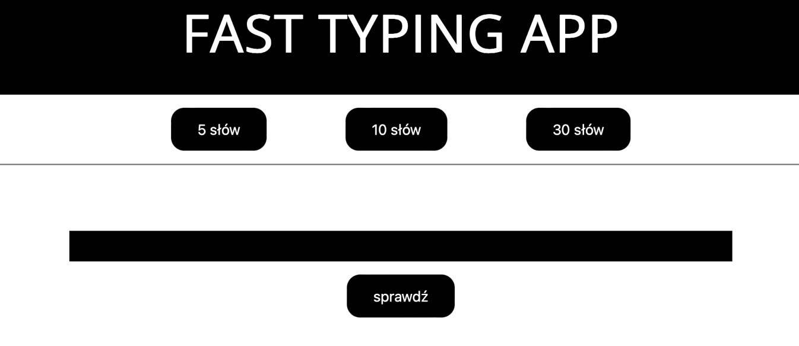
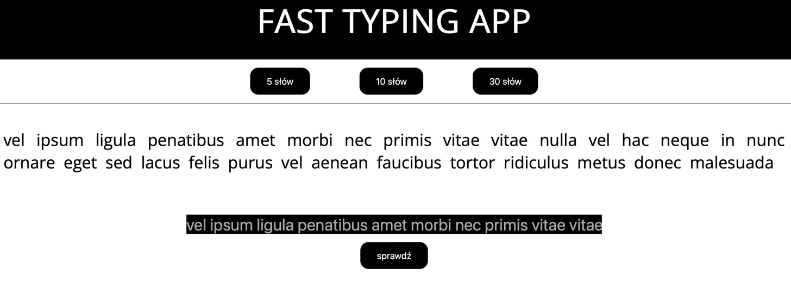
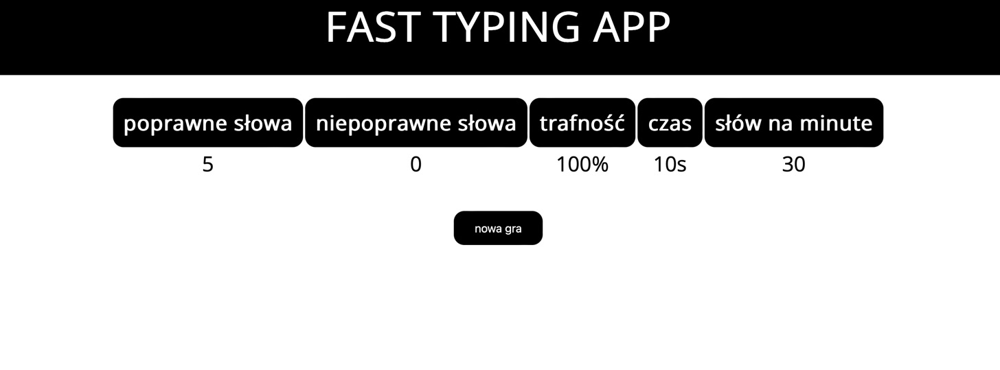

# Fast Typing App - Frontend
This app helps user to improve his typing skills. User selects length of text and try rewrite it without making mistakes
and as fast as possible. After rewriting the text, user can check statistics.

## Introduction
This project only contains frontend of the application, API is in a separate project on GitHub, link below:

`https://github.com/PiotrPiwowarski/fast-typing-backend`

## Technologies
This Frontend is created using following technologies:
* JavaScript
* Node.js, version: 18.15.0
* React, version: 18.2.0
* HTML
* CSS

## Screens
### Home

### Game

### Statistics

## Functionalities
### Game
* User can choose a game out of three possible ones
* Text appropriate to the selected game type will be displayed
* User can check statistics after finish typing by clicking the button below or pressing enter
### Statistics
* After the game is over, the following statistics are available: correct words, incorrect words, accuracy, game duration, typing speed (words per minute)

## Running the application
### Using Docker
1. Go to the main application folder 
2. Use following command in terminal `docker compose up`
3. Open `http://localhost:3000` in your browser

